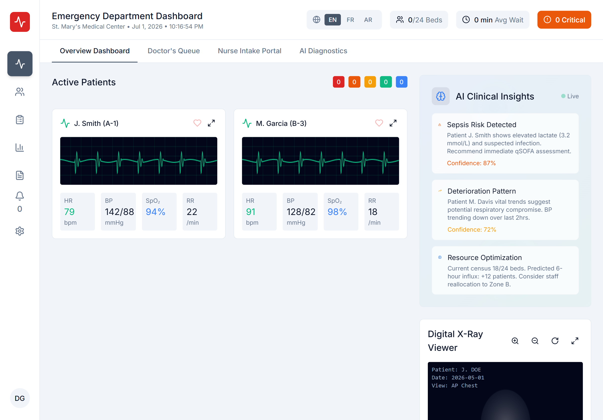

<div align="center">

# 🏥 Medical ER Dashboard

### A Full-Stack, AI-Powered Emergency Room Management System

[](#)
[](#)
[](#)
[](#)
[](#)

> **⚠️ This project is actively under development. Features are being added and refined continuously.**

</div>

---

## 📌 What Is This Project?

The **Medical ER Dashboard** is a comprehensive, real-time Emergency Room (ER) management system designed to modernize clinical operations in emergency departments. It centralizes patient tracking, clinical decision support, nurse intake, administrative control, and AI-powered diagnostics into a single, unified interface.

Built as a full-stack web application, the system bridges the gap between fragmented ER workflows, giving doctors, nurses, and administrators a clear, actionable view of every active patient and system resource — all in real time.

**Figma Design Reference:** [View Original Design on Figma](https://www.figma.com/design/EKSYIjN8NRjfloeP9elmvk/Design-Medical-ER-Dashboard)

---

## 🚨 Problem It Solves

Emergency departments face critical challenges:

- **Information silos** — patient data scattered across paper, EMR systems, and verbal handoffs
- **Delayed triage decisions** — no real-time overview of all patients' severity levels
- **Slow documentation** — manual vital sign entry and chart writing slow nurses down
- **Lack of AI decision support** — clinicians lack fast, pattern-based diagnostic assistance
- **No unified admin visibility** — staff performance, system health, and resource allocation tracked separately

This dashboard solves all of the above by providing a **single pane of glass** for the entire ER operation.

---

## ✨ Features

### 🖥️ Overview Dashboard
- Live patient cards with real-time ECG waveforms updating every 2 seconds
- AI Clinical Insights panel — sepsis risk detection, deterioration patterns, resource optimization
- Digital X-Ray Viewer with zoom, rotate, and fullscreen controls
- ESI (Emergency Severity Index) level filters (1–5) with color-coded badges

### 👨‍⚕️ Doctor's Queue
- Sortable live table (by name, ESI level, wait time)
- Sparkline vital trend mini-charts for HR and SpO₂
- Critical patient animations — ESI-1 rows pulse with red glow alerts

### 🩺 Nurse Intake Portal
- Comprehensive patient registration form with real-time validation
- **Voice Pulse Recorder** — one-click voice recording with animated waveform and live transcript
- Medical term highlighting in transcripts
- X-Ray drag-and-drop upload zone with AI processing animation and progress bar

### 🤖 AI Diagnostics Intelligence
- Top 3 differential diagnoses with ICD-10 codes and confidence score bars
- AI X-Ray analysis with bounding box overlays
- Voice summary audio playback
- Recent lab results panel with critical value alerts

### 📊 Analytics Dashboard
- 4 KPI cards with real-time trend indicators
- Time range selector: 24h / 7d / 30d views
- Interactive charts: Area, Pie, Bar, Radar — built with Recharts
- AI-powered operational recommendations

### 📋 Reports Center
- Quick-generate report templates (Shift, Clinical, Compliance, Performance)
- Search and filter by type and date range
- View, download, print, and share report actions
- Status tracking: Complete / Generating / Scheduled

### 🔔 Alert Management
- Dismissible and acknowledgeable alert feed with priority badges
- Sound notification toggle
- Filter by severity: Critical / Warning / Info
- Pulsing red glow animations on high-priority alerts

### ⚙️ System Settings
- Profile editor, notification preferences, security (2FA, sessions)
- Integration management (Epic EMR, PACS, LIS)
- API key management (copy, regenerate)
- Appearance settings: theme, font size, density, RTL mode

### 🔐 Admin Dashboard
- System KPI overview (patients, staff, critical cases, efficiency)
- Full Staff CRUD — add, edit, view, delete with role and status management
- Patient analytics with demographics and diagnosis distribution charts
- AI model monitoring (7 models, prediction vs. actual, radar performance charts)
- System Monitor — CPU/memory usage, service health, API latency, event logs

### 🌐 Multilingual Support
- Language switcher: **English / French / Arabic**
- Full RTL layout support for Arabic
- 50+ translated UI labels including medical terminology

---

## 📸 Screenshots

### Overview Dashboard


### Nurse Intake Portal
.png)

---

## 🔧 Technology Stack

| Layer | Technology |
|---|---|
| **Framework** | React 18.3 + TypeScript 5.5 |
| **Build Tool** | Vite 6.3 |
| **Styling** | Tailwind CSS 4.x + shadcn/ui |
| **UI Components** | Radix UI primitives, MUI (Material UI) |
| **Charts** | Recharts 2.x |
| **Animations** | Motion (Framer Motion), CSS keyframes |
| **Drag & Drop** | React DnD |
| **Forms** | React Hook Form |
| **Icons** | Lucide React, MUI Icons |
| **Real-Time** | Socket.io Client (WebSocket) |
| **HTTP Client** | Axios |
| **Routing** | React Router 7 |
| **Theming** | next-themes |
| **Toasts** | Sonner |

---

## 🚀 Getting Started

### Prerequisites
- Node.js >= 18
- npm or pnpm

### Installation

```bash
# Clone the repository
git clone https://github.com/khe-amro/medical-er-dashboard.git
cd medical-er-dashboard

# Install dependencies
npm install

# Start the development server
npm run dev
```

The app will be available at `http://localhost:5173`.

---

## 🗂️ Project Structure

```
medical-er-dashboard/
├── src/
│   ├── app/
│   │   ├── components/      # All UI components (Dashboard, Queue, Intake, etc.)
│   │   ├── hooks/           # Custom React hooks (useRealTimeVitals, etc.)
│   │   ├── i18n/            # Translation files (EN, FR, AR)
│   │   ├── App.tsx          # Root app component & routing logic
│   │   └── LanguageContext.tsx
│   ├── services/            # API service layer (Axios instances)
│   ├── styles/              # Global CSS & Tailwind config
│   └── main.tsx             # App entry point
├── screenshot/              # App screenshots
├── index.html
├── vite.config.ts
└── package.json
```

---

## 🔄 Current Development Status

> **🚧 This project is still actively being developed.**

### ✅ Completed
- [x] Full frontend UI (25+ components, 100+ interactive elements)
- [x] Real-time vital signs simulation (2s polling)
- [x] Multilingual support (EN / FR / AR + RTL)
- [x] AI Insights panel (frontend mock)
- [x] Admin dashboard with full staff CRUD
- [x] Analytics with interactive charts
- [x] Alert management system
- [x] Report generation interface
- [x] Settings, security, and integrations UI

### 🚧 In Progress
- [ ] Backend REST API (Node.js / Express)
- [ ] WebSocket server with Socket.io for live data
- [ ] Database integration (PostgreSQL / MongoDB)
- [ ] JWT authentication & role-based access control
- [ ] Real AI/ML model integration (diagnosis, X-ray analysis)
- [ ] PDF report generation
- [ ] Cloud file storage for X-rays (S3)
- [ ] Docker & deployment configuration

---

## 🤝 Contributing

Contributions, suggestions, and issue reports are welcome! Since the project is still in development, feel free to open an issue or submit a pull request.

---

## 📄 License

This project is licensed under a custom MIT-style license. See [LICENSE.md](./LICENSE.md) for details.

---

<div align="center">

Made with ❤️ by **khe-amro** · 2026

</div>